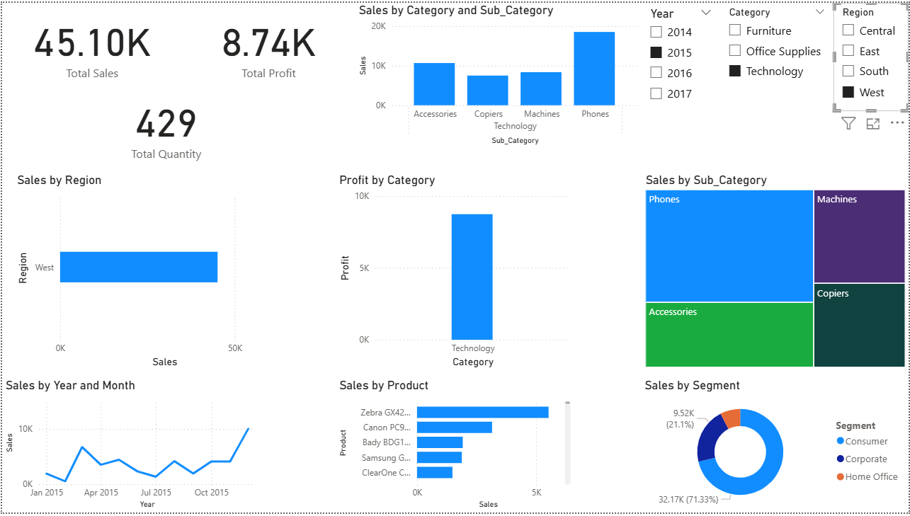
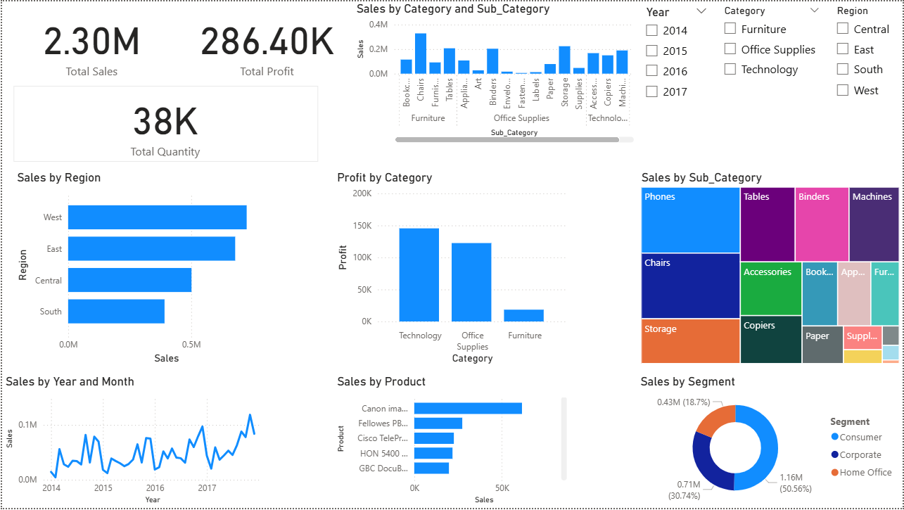

# 📊 Interactive Sales Analysis Dashboard

## 🧠 Objective
Visualize and analyze sales performance using Power BI.

## ✅ Features
- KPIs for Total Sales, Profit, and Quantity
- Monthly Sales Trend
- Sales by Region, Category, and Sub-Category
- Top 10 Products by Sales
- Sales by Customer Segment
- Slicers for Year, Region, and Category
- Drill-down from Category → Sub-Category

## 🛠️ Tools
- Power BI
- Superstore Sales Dataset

## 📷 Screenshots

## 📁 Files Included
- Sales_Dashboard.pbix
- Screenshots
